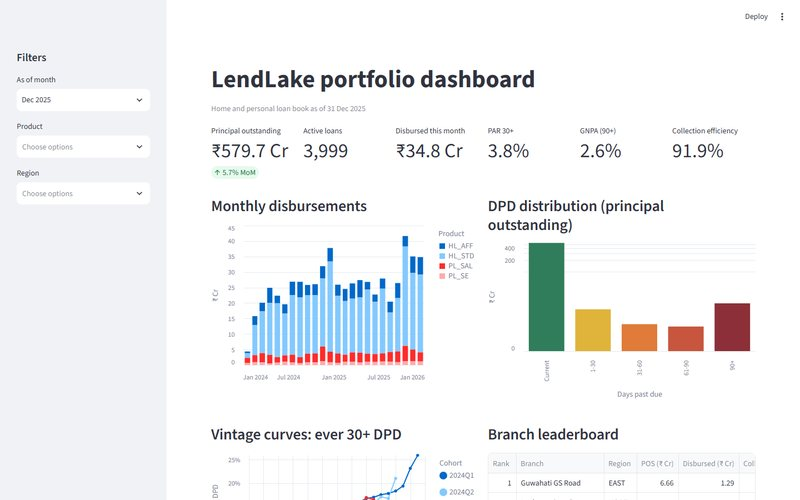
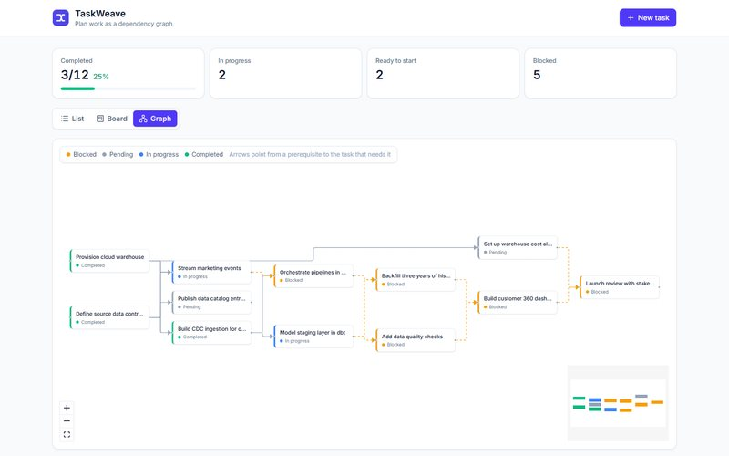
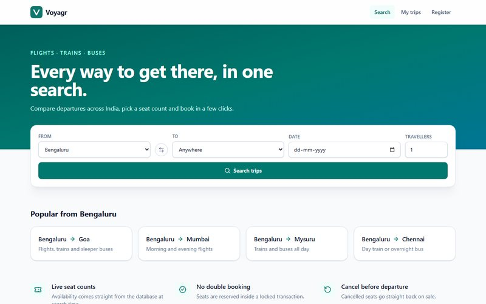
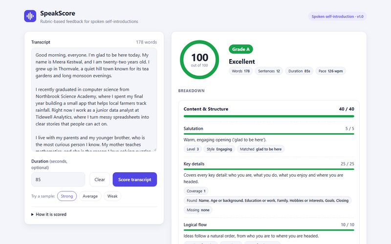
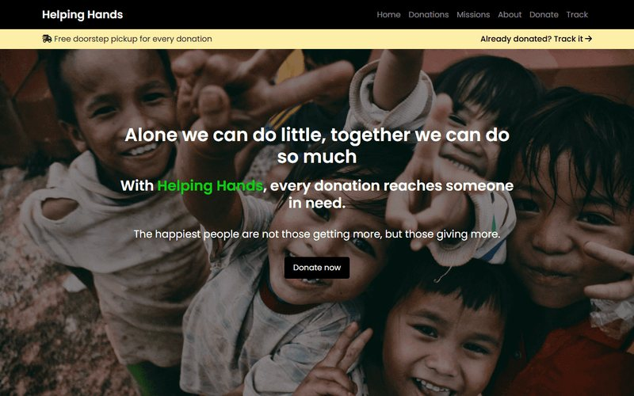
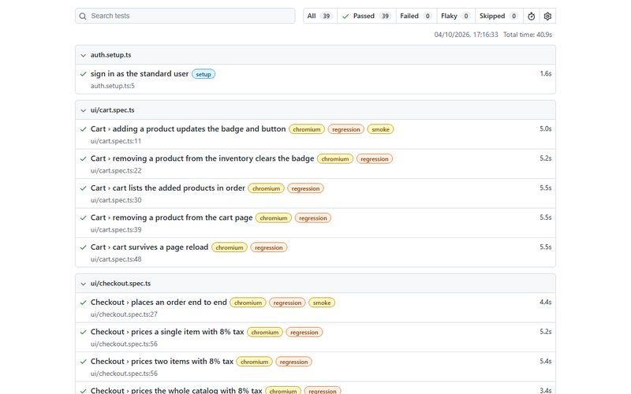

  
  
  

## About me

I'm a **Data Engineering Intern at Cuedo Analytics** in Bengaluru, building production pipelines in Python and SQL that load client data into PostgreSQL and Amazon Redshift, with validation and reconciliation checks so the numbers can be trusted.

- ☁️ **AWS Certified Data Engineer – Associate** and **Google Cloud Professional Data Engineer**
- 📄 **2× IEEE published**: healthcare ML ([ICISC 2025](https://ieeexplore.ieee.org/document/11188016)) and multilingual voice AI ([ICEMCSI 2026](https://ieeexplore.ieee.org/document/11602809))
- 🎓 **B.Tech, Computer Science and Engineering**, Dayananda Sagar University (2026), CGPA **9.16 / 10**
- 🏆 **3rd place**, DSU Code Red 24-hour hackathon

## Featured projects

<table>
<tr>
<td width="50%" valign="middle">

</td>
<td width="50%" valign="top">

### [LendLake](https://github.com/Raja9964/LendLake)

Lending analytics lakehouse on a **medallion architecture** (Bronze → Silver → Gold).

- Idempotent Python ingestion into DuckDB
- dbt Silver/Gold models, SCD2 snapshot, incremental facts
- **100+ dbt data-quality tests** and run-date-driven backfills
- Streamlit dashboard: DPD buckets, vintage curves, collection efficiency

<b>Python · dbt · DuckDB · SQL · Streamlit · GitHub Actions</b>

**[▶ Live dashboard](https://raja9964.github.io/LendLake/)** · <a href="https://github.com/Raja9964/LendLake">View code</a>

</td>
</tr>
<tr>
<td width="50%" valign="top">

**[TaskWeave](https://github.com/Raja9964/TaskWeave)**  
Task dependency manager with BFS cycle detection that shows the exact loop, recursive status propagation and an interactive graph. 
<b>Django REST · React · TypeScript · React Flow</b> 
<a href="https://raja9964.github.io/TaskWeave/"><b>▶ Live demo</b></a> · <a href="https://github.com/Raja9964/TaskWeave">View code</a>
</td>
<td width="50%" valign="top">

**[Voyagr](https://github.com/Raja9964/Voyagr)**  
Travel booking with overbooking-safe seat reservations (<code>SELECT … FOR UPDATE</code>), proven by a concurrent-booking test. 
<b>React · TypeScript · Express · MySQL</b> 
<a href="https://raja9964.github.io/Voyagr/"><b>▶ Live demo</b></a> · <a href="https://github.com/Raja9964/Voyagr">View code</a>
</td>
</tr>
<tr>
<td width="50%" valign="top">

**[SpeakScore](https://github.com/Raja9964/SpeakScore)**  
Explainable, rubric-driven scoring of spoken self-introductions: speech rate, grammar, vocabulary, clarity and engagement. 
<b>Python · Flask · NLP · VADER</b> 
<a href="https://raja9964.github.io/SpeakScore/"><b>▶ Live demo</b></a> · <a href="https://github.com/Raja9964/SpeakScore">View code</a>
</td>
<td width="50%" valign="top">

**[Helping Hands](https://github.com/Raja9964/Helping-Hands)**  
Donation platform with trackable donation codes, a privacy-safe public timeline and a live admin dashboard. 
<b>Node.js · Express · MongoDB · Server-Sent Events</b> 
<a href="https://raja9964.github.io/Helping-Hands/"><b>▶ Live demo</b></a> · <a href="https://github.com/Raja9964/Helping-Hands">View code</a>
</td>
</tr>
<tr>
<td width="50%" valign="top">

**[Pagewright](https://github.com/Raja9964/Pagewright)**  
Playwright + TypeScript test framework: page objects, typed fixtures, UI and API suites with schema checks. 
<b>Playwright · TypeScript · GitHub Actions</b> 
<a href="https://raja9964.github.io/Pagewright/"><b>▶ Live test report</b></a> · <a href="https://github.com/Raja9964/Pagewright">View code</a>
</td>
<td width="50%" valign="middle" align="center">

### 🌐 [raja9964.github.io](https://raja9964.github.io)
Experience, publications, certifications and every project in one place.

</td>
</tr>
</table>

## Publications

| Paper | Venue |
|---|---|
| **[SeniorConnect: A Voice-Enabled Mobile Platform with Regional Language Support for Elderly Well-Being and Government Scheme Advisory Across India](https://ieeexplore.ieee.org/document/11602809)** DOI [10.1109/ICEMCSI67638.2026.11602809](https://doi.org/10.1109/ICEMCSI67638.2026.11602809) | IEEE ICEMCSI 2026 Bengaluru · Jun 2026 |
| **[Multi-Disease Detection Using Hybrid Models and Transfer Learning: Cardiovascular, Pulmonary, Retinal and Renal](https://ieeexplore.ieee.org/document/11188016)** Kidney 98.75% · Pulmonary 91.00% · Cardiovascular 86.41% · Retinopathy 85.54% accuracy · DOI [10.1109/ICISC65841.2025.11188016](https://doi.org/10.1109/ICISC65841.2025.11188016) | IEEE ICISC 2025 Coimbatore · Aug 2025 |

## Certifications

| | Certification | Issued | Valid until |
|---|---|---|---|
|  | **AWS Certified Data Engineer – Associate** (DEA-C01) | Jul 2026 | Jul 2029 |
|  | **Google Cloud Certified Professional Data Engineer** | Mar 2026 | Mar 2028 |

## Experience

### Data Engineering Intern · Cuedo Analytics
Bengaluru, India · Feb 2026 – Present

- Built production data pipelines in Python and SQL that ingest and transform client datasets into PostgreSQL and Amazon Redshift.
- Wrote SQL validation and reconciliation checks across source and target systems (row counts, totals, consistency).
- Implemented data-quality checks and tuned Redshift queries for analytical workloads.
- Ran disaster-recovery tests on production workflows and documented pipelines for cross-team handoff.
- **Cloud data migration:** PostgreSQL → Amazon Redshift with AWS DMS full load + CDC, Amazon S3 and AWS Glue / PySpark.

## Tech stack

| Area | Stack |
|---|---|
| **Languages** |     |
| **Data engineering** |      |
| **AWS** |       |
| **Google Cloud** |   |
| **Databases** |    |
| **Tools** |      |
| **ML** |   |

<b>Raw data in. Reliable insights out.</b> 
<a href="https://raja9964.github.io">Portfolio</a> · <a href="https://www.linkedin.com/in/raja-mohamad-711161262">LinkedIn</a> · <a href="mailto:raja123.mrb@gmail.com">Email</a>

